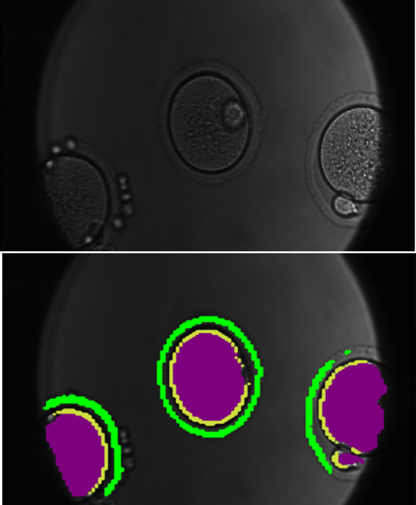

# Oocyte Cell Segmentation

## Overview

The goal of this project is to accurately detect and segment different parts of Oocyte cells, including Cytoplasm, Zona Pellucida, and Oolemma. Computer Vision AI segmentation models have been applied to each class, and postprocessing techniques have been employed to improve segmentation masks. The project addresses the challenging task of detecting the hollow circle for the Zona Pellucida and Oolemma classes, with significant progress made in accurately identifying these structures.

## Key Features

- Accurate segmentation of Oocyte cell components: Cytoplasm, Zona Pellucida, and Oolemma.
- Application of Computer Vision AI segmentation models for precise identification.
- Postprocessing techniques to refine segmentation masks.
- Special focus on the challenging detection of the hollow circle in Zona Pellucida and Oolemma classes.
- Promising improvements in segmentation accuracy, particularly for Cytoplasm and Zona Pellucida.

## Project Structure
```plaintext
|-- code/
| |-- config.py
| |-- inference.py
| |-- machine_format.py
| |-- oocyte_visualizer.py
| |-- postprocessing.py
| |-- preprocess.py
| |-- semantic_seg_data_preparation.py
| |-- semantic_segm_models.py
| |-- trainer.py
|-- oocyte_semantic_segm_v3.ipynb
|-- LICENSE
|-- sample_images
|-- README.md

## Usage

1. Explore the [`oocyte_semantic_segm_v3.ipynb`](oocyte_semantic_segm_v3.ipynb) Jupyter notebook for data preprocessing, model training, and inference.

2. Use the `utils` directory for utility scripts related to data preprocessing, model training, and postprocessing.

## Results

### Sample Output



## Challenges and Future Work

The Oolemma segmentation still presents challenges, and additional labeled data is needed for enhanced accuracy. Contributions and suggestions for improvement are welcome.

## License

This project is licensed under the [MIT License](LICENSE).

Feel free to explore, contribute, and provide feedback!
